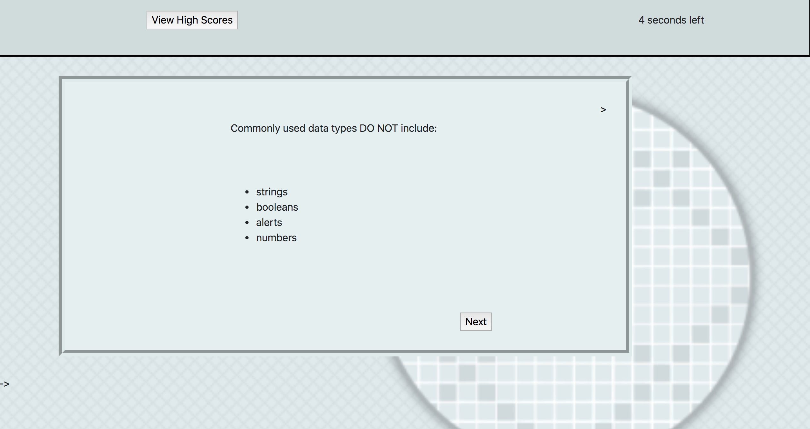
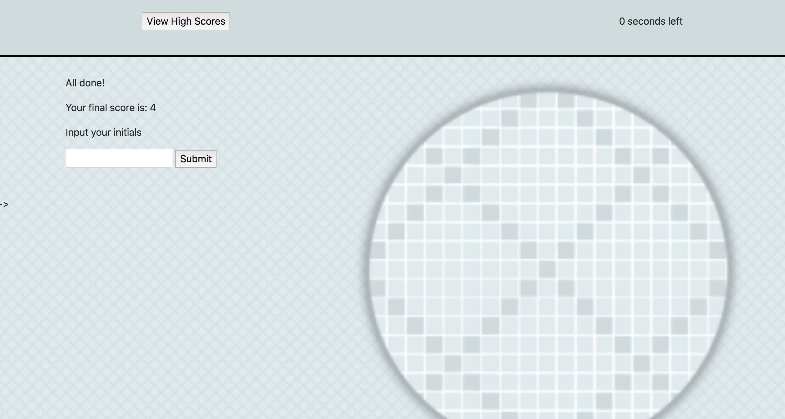

# Coding-Quiz
​
### Table of Contents
- [Description](#Description)
- [Technologies-Libraries](#Technologies-Libraries)
- [Screenshots](#Screenshots)
- [Link](#Link)
​
### Description
A timer-based javascript coding quiz which keeps track of user scores 
​
### Technologies-Libraries
- [Bootstrap](https://getbootstrap.com/) - CSS Framework
- [JQuery](https://jquery.com/)
​
### Screenshots
​

​

​
### Link
https://raklevan.github.io/coding-quiz/